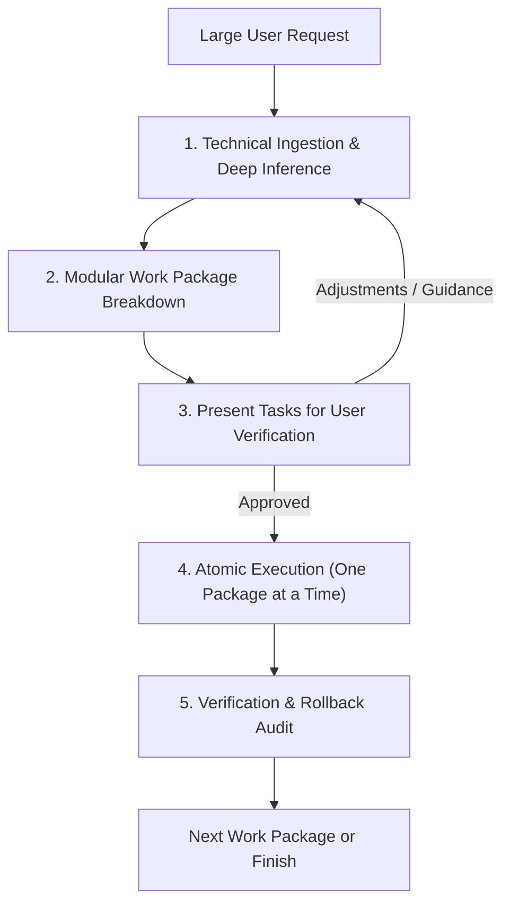

# Work Packages (Task Decomposition & Technical Inference)

Use this skill whenever handling large feature requests, architectural overhauls, major refactors, or cross-cutting changes. It enforces modular work breakdown, deep technical dialogue with proficient developers, and verified task lists so AI agents focus on small, bounded problems rather than getting overwhelmed by the whole picture.

---

## Core Invariants

1. **Project-Agnostic & Reusable**:
   - Applicable to any technology stack, framework, language, or architecture.
   - Focuses on universal software engineering principles: modularity, state invariants, blast radius minimization, and verification gates.

2. **Senior Developer Peer Dynamic**:
   - The user is technically proficient and skilled at coding.
   - **Be as technical as possible**: Discuss low-level mechanics, concurrency semantics, cache invalidation, API boundaries, state machines, and system trade-offs.
   - **Ask for detailed inference**: Prompt the user on architectural decisions, trade-offs, and design choices. The user will research, evaluate, and provide precise guidance.

3. **Atomic Work Packages**:
   - Split large work into small, self-contained packages (WP-01, WP-02, etc.).
   - Each package must be small enough that a single AI agent or subagent can execute it cleanly without context drift or regressions.

4. **Crisp 1-Sentence Task Standard**:
   - When presenting tasks, each task MUST lead with a **single, crisp sentence** stating the exact technical change.
   - Accompany each task with affected files/modules, interface/data contracts, and acceptance verification.

5. **Mandatory User Verification Gate**:
   - **Never** write code on big changes without presenting the work packages first.
   - Produce the breakdown directly in front of the user so they can verify, refine, or approve it.

---

## Workflow



---

### Phase 1: Technical Ingestion & Deep Inference

Before structuring packages, analyze the technical implications and formulate targeted inference questions for the user:

- **State & Data Invariants**: How should data mutate? (Optimistic updates vs ACID transactions, schema migration requirements, backward compatibility).
- **Concurrency & Failure Modes**: How are network drops, race conditions, or conflicting edits handled?
- **Architecture & Performance**: What are the trade-offs between alternative implementations (e.g. streaming vs polling, normalization vs denormalization)?
- **Blast Radius**: Which adjacent systems, modules, or tests could be impacted?

---

### Phase 2: Work Package & Task Definition

Group work into sequential, testable Work Packages (`WP-01`, `WP-02`, etc.).

Format every package using this standard:

```markdown
### 📦 Work Package [ID]: [Title]
**Scope**: [Bounded domain: e.g. Data Layer, Edge API, State/Hook, or UI View]
**Dependencies**: [None | WP-01 | etc.]

#### Tasks:
- [ ] **Task [ID.1]**: [Single crisp sentence stating the exact technical change].
  - **Modules / Files**: `path/to/file`
  - **Technical Contract**: [Types, parameters, state mutations, or API schema]
  - **Inference Point**: [Key architectural rationale or trade-off]
  - **Verification**: [Command, unit test, or inspection step]

- [ ] **Task [ID.2]**: [Single crisp sentence stating the exact technical change].
  ...
```

---

### Phase 3: Present for User Verification

Stop and display the work packages clearly. Ask the user:
1. Specific technical inference questions regarding architectural choices.
2. Confirmation or adjustments to the proposed task breakdown.

> **Rule**: Await user feedback or approval before modifying files or delegating to subagents.

---

### Phase 4: Atomic Execution & Subagent Delegation

Once verified:
1. Execute **one work package at a time**.
2. If delegating to a subagent (`invoke_subagent`), supply only that package's prompt, targeted files, and acceptance criteria.
3. Validate each task against its verification step before moving to the next package.
