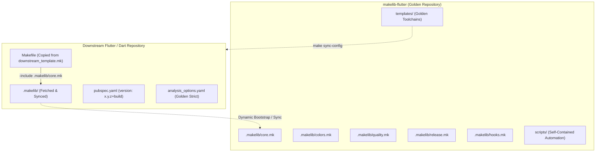

# makelib-flutter

[](https://github.com/sudo-krish/makelib-flutter)
[](https://github.com/sudo-krish/makelib-flutter)
[](https://github.com/sudo-krish/makelib-flutter)
[](https://github.com/sudo-krish/makelib-flutter)

A centralized, self-hosting **GNU Make library** and **golden toolchain configuration** for Flutter and Dart applications and packages. Mirroring the architectural precision and zero-copy inclusion model of `makelib-node` and `makelib-py`, `makelib-flutter` provides turnkey DevOps pipelines, shift-left branch enforcement, 8-stage industrial quality gates, and branch-driven SemVer automation.

---

## Architecture & Zero-Copy Downstream Inclusion Model

Downstream repositories **never duplicate Makefiles**. Instead, they adopt a single-line inclusion model via GNU Make's `-include`:



### Key Capabilities
- **Zero-Copy Architecture**: Downstream projects maintain a clean 30-line `Makefile` that pulls and updates `.makelib/` dynamically.
- **Overridable Defaults (`?=`)**: All directory paths, command runners, thresholds, and binaries can be overridden conditionally in downstream Makefiles.
- **8-Stage Industrial Quality Gate**: Non-mutating format checks, strict linter, static typing, McCabe cyclomatic complexity $\le 10$, dependency audit, credential leak scan, open-source license whitelist, and $\ge 80\%$ line coverage verification.
- **Shift-Left Branch Policy**: Hard prohibition of direct commits to `main`/`master`, branch regex validation, and dual-layer Git hooks (Lefthook + native Git hooks).
- **Branch-Driven SemVer Release Automation**: Automated release level classification from branch prefixes with full `version: MAJOR.MINOR.PATCH+BUILD` mutation for Flutter `pubspec.yaml`.
- **Golden DevOps Templates**: Turnkey `analysis_options.yaml` (zero-tolerance casts/raw types), `pubspec.yaml`, `.gitignore`, `lefthook.yml`, `.secrets.baseline`, and GitHub Actions workflows (`ci.yml`, `release.yml`, `sync-template.yml`).
- **Downstream Override Protection**: `scripts/sync-config.sh` respects `# NO-OVERRIDE` or `# DO NOT OVERWRITE` markers in downstream files.

---

## Downstream Quickstart

### 1. Initialize Makelib in Downstream Repository
Copy `downstream_template.mk` into your downstream project as `Makefile`:

```bash
# In downstream Flutter/Dart project root:
curl -fsSL https://raw.githubusercontent.com/sudo-krish/makelib-flutter/main/downstream_template.mk -o Makefile
```

### 2. Bootstrap Toolchain and Hooks
Run the automated bootstrap target:

```bash
# Fetch core makefiles, helper scripts, and synchronize golden templates
make init-makelib

# Install shift-left Git hooks (Lefthook + native pre-commit & commit-msg)
make install-hooks
```

### 3. Verify Quality Gates
```bash
# Run all 8 industrial quality gates sequentially:
make check-all
```

---

## Overridable Makefile Defaults (`?=`)

All toolchain parameters can be configured downstream without editing `.makelib/` files:

| Variable | Default Value | Description |
| :--- | :--- | :--- |
| `SRC_DIR` | `lib` | Application / library source code directory |
| `TEST_DIR` | `test` | Unit and integration test directory |
| `BUILD_DIR` | `build` | Compilation and build output directory |
| `COVERAGE_DIR` | `coverage` | Output directory for `lcov.info` coverage reports |
| `MIN_COVERAGE` | `80` | Required minimum line coverage percentage ($\%$) |
| `MAX_COMPLEXITY`| `10` | Maximum allowable McCabe cyclomatic complexity per function |
| `FLUTTER` | `flutter` | Flutter CLI executable binary |
| `DART` | `dart` | Dart CLI executable binary |
| `LEFTHOOK` | `lefthook` | Lefthook binary for Git hook orchestration |
| `DETECT_SECRETS`| `detect-secrets` | Yelp detect-secrets binary for credential scanning |
| `OSV_SCANNER` | `osv-scanner` | Open Source Vulnerability scanner binary |
| `ALLOWED_LICENSES` | `MIT;Apache-2.0;...` | Semicolon-delimited approved license whitelist |

Example downstream customization in `Makefile`:
```makefile
MIN_COVERAGE   := 90
MAX_COMPLEXITY := 8
FLUTTER        := fvm flutter

-include .makelib/core.mk
```

---

## 8-Stage Industrial Quality Gate Pipeline

Run `make check-all` to sequentially execute all 8 gates with colorized status headers and failure short-circuiting:

```
======================================================================
              RUNNING 8-STAGE QUALITY GATE PIPELINE                  
======================================================================
[GATE] Verifying code formatting...
[SUCCESS] Formatting check passed.
[GATE] Running strict static code analyzer...
[SUCCESS] Strict linter passed with 0 errors/warnings.
[GATE] Running strict static type checking...
[SUCCESS] Static type check passed.
[GATE] Verifying code complexity & metrics (cyclomatic <= 10)...
[SUCCESS] Code complexity and metrics passed.
[GATE] Auditing dependencies for security advisories...
[SUCCESS] Dependency vulnerability audit passed.
[GATE] Scanning for leaked secrets with detect-secrets...
[SUCCESS] Secret scan passed (0 unexempted secrets).
[GATE] Verifying open-source dependency licenses...
[SUCCESS] License compliance check passed.
[GATE] Running tests with coverage (threshold: 80%)...
[SUCCESS] Test suite and coverage passed.
======================================================================
              ALL 8 QUALITY GATES PASSED CLEANLY!                    
======================================================================
```

### Target Reference

| Target | Gate | Description | Command Under the Hood |
| :--- | :--- | :--- | :--- |
| `make format` | - | Auto-formats codebase | `dart format lib test` |
| `make format-check` | **Gate 1** | Non-mutating format check | `dart format --output=none --set-exit-if-changed lib test` |
| `make lint` | **Gate 2** | Strict analyzer verification | `flutter analyze --fatal-infos --fatal-warnings` or `dart analyze` |
| `make type-check` | **Gate 3** | Strict static type enforcement | `dart analyze --fatal-infos` (enforcing strict casts & raw types) |
| `make smell` | **Gate 4** | Complexity & AST metric rule | `check-complexity.dart` (enforcing cyclomatic complexity $\le 10$) |
| `make audit` | **Gate 5** | CVE & vulnerability scan | `dart pub audit` or `osv-scanner --lockfile=pubspec.lock` |
| `make secret-scan` | **Gate 6** | Credential leak detection | `detect-secrets scan --baseline .secrets.baseline` |
| `make license-check`| **Gate 7** | Open-source license whitelist | `check-licenses.dart` (enforcing permitted license set) |
| `make test` | **Gate 8** | Unit tests & coverage gate | `flutter test --coverage` + `check-coverage.sh` ($\ge$ `MIN_COVERAGE%`) |
| `make check-all` | **All** | Master sequential execution | Executes Gates 1–8 sequentially with failure short-circuiting |

---

## Shift-Left Branch Policy & Hook Enforcement

### Branch Naming Standard
Direct commits to `main` and `master` are strictly forbidden. All active branches must conform to the regex:
```regex
^(feat|feature|fix|patch|major|breaking|docs|chore|refactor|ci)/[a-z0-9._-]+$
```

### SemVer Release Mapping

| Branch Prefix | SemVer Level | SemVer Increment (`pubspec.yaml`) | Example |
| :--- | :--- | :--- | :--- |
| `major/`, `breaking/` | **MAJOR** | Increments $X.0.0$ and auto-increments $+BUILD$ | `1.0.0+1` $\rightarrow$ `2.0.0+2` |
| `feat/`, `feature/` | **MINOR** | Increments $x.Y.0$ and auto-increments $+BUILD$ | `1.0.0+1` $\rightarrow$ `1.1.0+2` |
| `fix/`, `patch/` | **PATCH** | Increments $x.y.Z$ and auto-increments $+BUILD$ | `1.0.0+1` $\rightarrow$ `1.0.1+2` |
| `docs/`, `chore/`, `refactor/`, `ci/` | **PATCH** | Increments $x.y.Z$ and auto-increments $+BUILD$ | `1.0.0+1` $\rightarrow$ `1.0.1+2` |

### Dual Hook Mechanism
`make install-hooks` configures:
1. **Lefthook (`lefthook.yml`)**: Fast, parallelized pre-commit and commit-msg runner.
2. **Native Git Hooks (`.git/hooks/pre-commit`, `.git/hooks/commit-msg`)**: Native fallback scripts ensuring shift-left policies remain enforceable on machines without Lefthook installed.

---

## Branch-Driven SemVer Release Automation

`makelib-flutter` provides turnkey release targets:

```bash
# Preview SemVer classification for active branch
make release-classify

# Bump specific SemVer level in pubspec.yaml
make bump-patch  # 1.0.0+1 -> 1.0.1+2
make bump-minor  # 1.0.0+1 -> 1.1.0+2
make bump-major  # 1.0.0+1 -> 2.0.0+2

# Execute automated release pipeline:
# 1. Runs `make check-all`
# 2. Automatically classifies and bumps version from active branch
# 3. Commits pubspec.yaml and pubspec.lock
# 4. Creates annotated Git tag (e.g., `v1.1.0`)
make release
```

---

## Golden Toolchain Templates & Sync Protection

Upstream templates in `templates/` can be refreshed downstream at any time:

```bash
# Update makelib core files and scripts
make update-makelib

# Sync golden configs
make sync-config
```

### Downstream Override Protection
To customize any golden configuration downstream without it being overwritten during `make sync-config`, simply include `# NO-OVERRIDE` or `# DO NOT OVERWRITE` anywhere in the file:

```yaml
# NO-OVERRIDE
# Custom downstream analysis options
include: package:flutter_lints/flutter.yaml
```

When `sync-config.sh` detects this marker, it preserves the downstream file and outputs:
```
[SKIP] 'analysis_options.yaml' contains NO-OVERRIDE marker. Preserving.
```

---

## Self-Hosting Repository Layout

```
.
├── .github/
│   └── workflows/
│       ├── ci.yml                 # CI quality gate workflow
│       ├── release.yml            # Release automation workflow
│       └── sync-template.yml      # Template drift verification
├── .makelib/
│   ├── colors.mk                  # ANSI color constants & prefixes
│   ├── core.mk                    # Core variables, paths, binaries, help menu, clean, build
│   ├── hooks.mk                   # Git hook management targets
│   ├── quality.mk                 # 8-stage industrial quality gate pipeline
│   └── release.mk                 # SemVer release targets
├── downstream_template.mk         # Copy-paste downstream Makefile with bootstrap
├── Makefile                       # Self-hosting root Makefile
├── pubspec.yaml                   # Root package manifest
├── analysis_options.yaml          # Root strict linter configuration
├── lefthook.yml                   # Root lefthook configuration
├── .gitignore                     # Root gitignore
├── .secrets.baseline              # Root secret baseline
├── README.md                      # Comprehensive documentation
├── lib/
│   └── makelib_flutter.dart       # Self-hosting library implementation
├── test/
│   └── makelib_flutter_test.dart  # Unit tests with 100% coverage
├── scripts/
│   ├── check-branch.sh            # Shift-left branch regex validator
│   ├── check-complexity.dart      # Cyclomatic complexity analyzer (<= 10)
│   ├── check-coverage.sh          # LCOV line coverage parser (>= 80%)
│   ├── check-licenses.dart        # Open-source license whitelist checker
│   ├── install-hooks.sh           # Lefthook & native git hook installer
│   ├── semver-release.sh          # pubspec.yaml SemVer & build number bumper
│   └── sync-config.sh             # Downstream golden config synchronizer
└── templates/
    ├── .github/workflows/
    │   ├── ci.yml
    │   ├── release.yml
    │   └── sync-template.yml
    ├── .gitignore
    ├── .secrets.baseline
    ├── analysis_options.yaml
    ├── lefthook.yml
    └── pubspec.yaml
```

---

## License

Permitted open source license whitelist: `MIT;Apache-2.0;BSD-2-Clause;BSD-3-Clause;ISC;0BSD;Unlicense;CC0-1.0`.
Distributed under the [MIT License](LICENSE).
